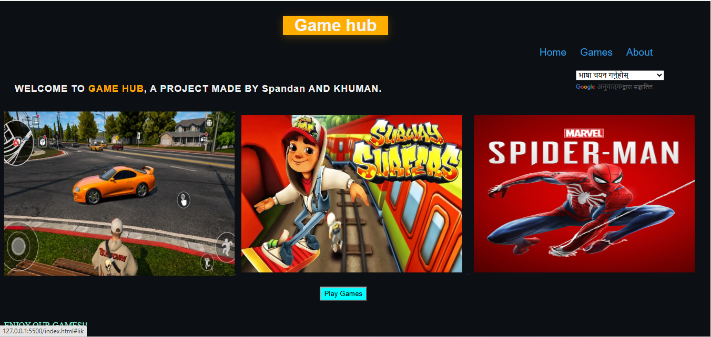
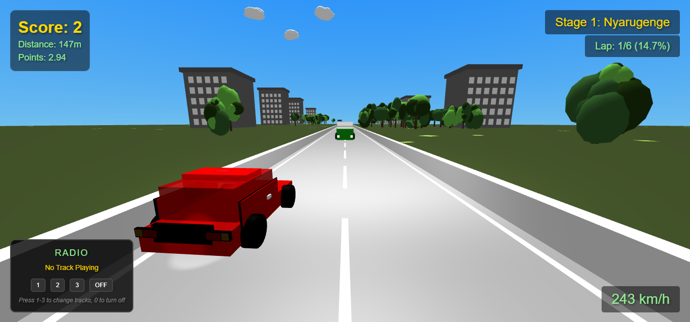
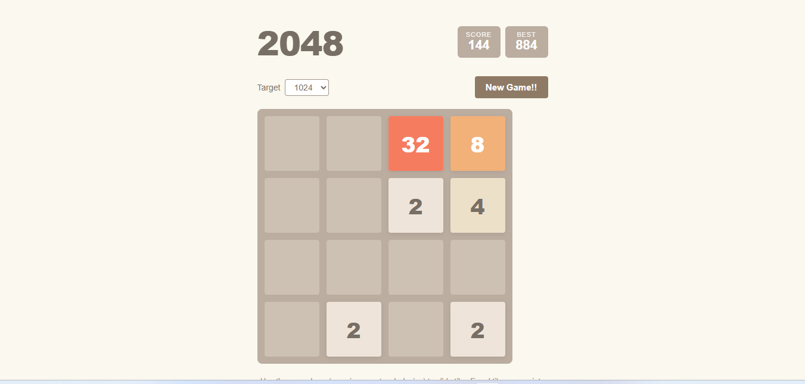
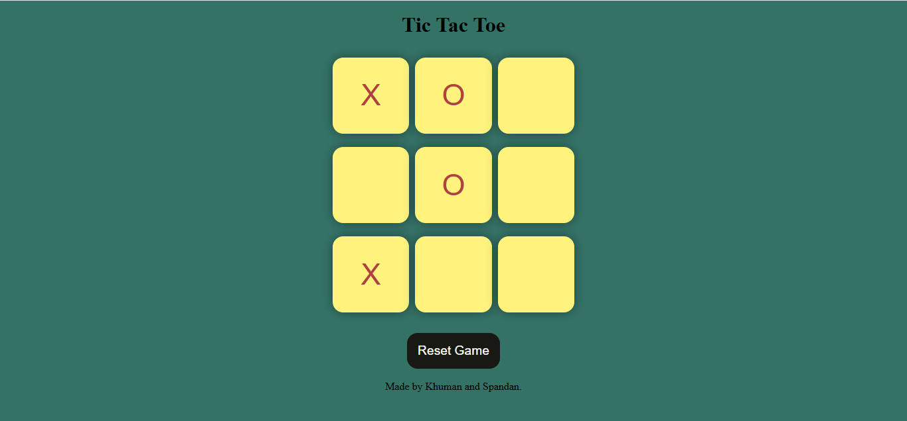
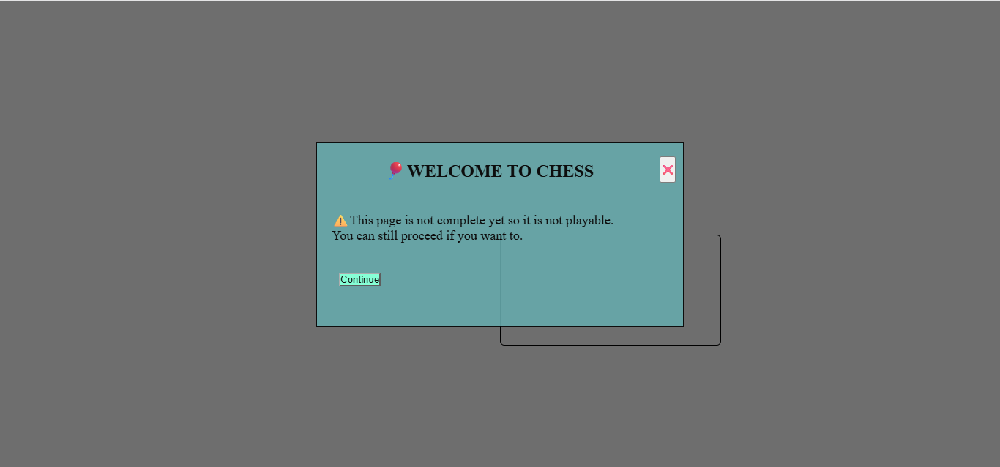

# GameHub
 A website consisting of various fun games made entirely with html , css and javascript. This is made by 2 individuals i.e Khuman and Spandan. As of the second week of third space this contains 5 games of which 2 arent complete.

# Featured Games :
 1) 3D-Car game (Html , Css , js(vanilla)) 
 2) 2048 
 3) Tic-Tac-Toe  
 4) Chess (Not complete) 
 5) Pac man(Not Complete)  

# Technologised used :
1. HTML
2. CSS
3. Js

 # How to run locally
  1) Clone the repositary
  2) Open the game :- Open index.html in your browser
  3) Play the game
 
 # made by :
 Spandan And Khuman 

# Demo : 
https://spandanbaralbk.github.io/GameHub/

# Note 
work in progress !!
